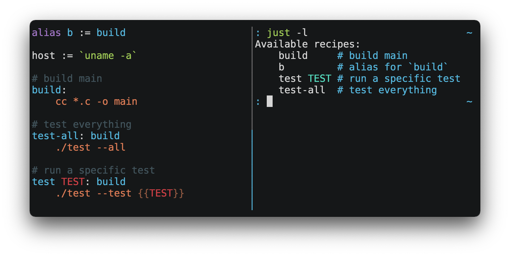

= `just`
:toc: macro
:toc-title:

image:https://img.shields.io/crates/v/just.svg[crates.io version,link=https://crates.io/crates/just]
image:https://github.com/casey/just/workflows/Build/badge.svg[build status,link=https://github.com/casey/just/actions]
image:https://img.shields.io/github/downloads/casey/just/total.svg[downloads,link=https://github.com/casey/just/releases]
image:https://img.shields.io/discord/695580069837406228?logo=discord[chat on discord,link=https://discord.gg/ezYScXR]
image:https://img.shields.io/badge/Say%20Thanks-!-1EAEDB.svg[say thanks,link=mailto:casey@rodarmor.com?subject=Thanks for Just!]

`just` is a handy way to save and run project-specific commands.

(非官方中文文档,link:https://github.com/chinanf-boy/just-zh[这里],快看过来!)

Commands, called recipes, are stored in a file called `justfile` with syntax inspired by `make`:



You can then run them with `just RECIPE`:

[source,sh]
----
$ just test-all
cc *.c -o main
./test --all
Yay, all your tests passed!
----

`just` has a ton of useful features, and many improvements over `make`:

- `just` is a command runner, not a build system, so it avoids much of
  link:https://github.com/casey/just#what-are-the-idiosyncrasies-of-make-that-just-avoids[`make`'s
  complexity and idiosyncrasies]. No need for `.PHONY` recipes!

- Linux, MacOS, and Windows are supported with no additional dependencies. (Although if your system doesn't have an `sh`, you'll need to link:https://github.com/casey/just#shell[choose a different shell].)

- Errors are specific and informative, and syntax errors are reported along with their source context.

- Recipes can accept
  link:https://github.com/casey/just#recipe-parameters[command line arguments].

- Wherever possible, errors are resolved statically. Unknown recipes and
  circular dependencies are reported before anything runs.

- `just` link:https://github.com/casey/just#dotenv-integration[loads `.env`
  files], making it easy to populate environment variables.

- Recipes can be
  link:https://github.com/casey/just#listing-available-recipes[listed from the
  command line].

- Command line completion scripts are
  link:https://github.com/casey/just#shell-completion-scripts[available for
  most popular shells].

- Recipes can be written in
  link:https://github.com/casey/just#writing-recipes-in-other-languages[arbitrary
  languages], like Python or NodeJS.

- `just` can be invoked from any subdirectory, not just the directory that contains the `justfile`.

- And link:https://github.com/casey/just#manual[much more]!

If you need help with `just` please feel free to open an issue or ping me on link:https://discord.gg/ezYScXR[Discord]. Feature requests and bug reports are always welcome!

[discrete]
== Manual

toc::[]

== Installation

=== Prerequisites

`just` should run on any system with a reasonable `sh`, including Linux, MacOS, and the BSDs.

On Windows, `just` works with the `sh` provided by https://git-scm.com[Git for Windows], https://desktop.github.com[GitHub Desktop], or http://www.cygwin.com[Cygwin].

If you'd rather not install `sh`, you can use the `shell` setting to use the shell of your choice.

Like PowerShell:

[source,make]
----

# use PowerShell instead of sh:
set shell := ["powershell.exe", "-c"]

hello:
  Write-Host "Hello, world!"
----

…or `cmd.exe`:

[source,make]
----

# use cmd.exe instead of sh:
set shell := ["cmd.exe", "/c"]

list:
  dir
----

You can also set the shell using command-line arguments. For example, to use PowerShell, launch `just` with `--shell powershell.exe --shell-arg -c`.

(PowerShell is installed by default on Windows 7 SP1 and Windows Server 2008 R2 S1 and later, and `cmd.exe` is quite fiddly, so PowerShell is recommended for most Windows users.)

=== Packages

[cols="1,1,1,1", options="header"]
|===
| Operating System
| Package Manager
| Package
| Command

| https://forge.rust-lang.org/release/platform-support.html[Various]
| https://www.rust-lang.org[Cargo]
| https://crates.io/crates/just[just]
| `cargo install just`

| https://en.wikipedia.org/wiki/Microsoft_Windows[Microsoft Windows]
| https://scoop.sh[Scoop]
| https://github.com/ScoopInstaller/Main/blob/master/bucket/just.json[just]
| `scoop install just`

| https://docs.brew.sh/Installation[Various]
| https://brew.sh[Homebrew]
| https://formulae.brew.sh/formula/just[just]
| `brew install just`

| https://en.wikipedia.org/wiki/MacOS[macOS]
| https://www.macports.org[MacPorts]
| https://ports.macports.org/port/just/summary[just]
| `port install just`

| https://www.archlinux.org[Arch Linux]
| https://wiki.archlinux.org/title/Pacman[pacman]
| https://archlinux.org/packages/community/x86_64/just/[just]
| `pacman -S just`

| https://nixos.org/nixos/[NixOS],
  https://nixos.org/nix/manual/#ch-supported-platforms[Linux],
  https://nixos.org/nix/manual/#ch-supported-platforms[macOS]
| https://nixos.org/nix/[Nix]
| https://github.com/NixOS/nixpkgs/blob/master/pkgs/development/tools/just/default.nix[just]
| `nix-env -iA nixos.just`

| https://getsol.us/[Solus]
| https://getsol.us/articles/package-management/basics/en[eopkg]
| https://dev.getsol.us/source/just/[just]
| `eopkg install just`

| https://voidlinux.org[Void Linux]
| https://wiki.voidlinux.org/XBPS[XBPS]
| https://github.com/void-linux/void-packages/blob/master/srcpkgs/just/template[just]
| `xbps-install -S just`

| https://www.freebsd.org/[FreeBSD]
| https://www.freebsd.org/doc/handbook/pkgng-intro.html[pkg]
| https://www.freshports.org/deskutils/just/[just]
| `pkg install just`

| https://alpinelinux.org/[Alpine Linux]
| https://wiki.alpinelinux.org/wiki/Alpine_Linux_package_management[apk-tools]
| https://pkgs.alpinelinux.org/package/edge/community/x86_64/just[just]
| `apk add just`

| https://getfedora.org/[Fedora Linux]
| https://dnf.readthedocs.io/en/latest/[DNF]
| https://src.fedoraproject.org/rpms/rust-just[just]
| `dnf install just`

| https://www.gentoo.org/[Gentoo Linux]
| https://wiki.gentoo.org/wiki/Portage[Portage]
| https://github.com/gentoo-mirror/dm9pZCAq/tree/master/sys-devel/just[dm9pZCAq overlay: sys-devel/just]
| `eselect repository enable dm9pZCAq && emerge --sync dm9pZCAq && emerge sys-devel/just`

| https://docs.conda.io/en/latest/miniconda.html#system-requirements[Various]
| https://docs.conda.io/projects/conda/en/latest/index.html[Conda]
| https://anaconda.org/conda-forge/just[just]
| `conda install -c conda-forge just`

| https://en.wikipedia.org/wiki/Microsoft_Windows[Microsoft Windows]
| https://chocolatey.org/[Chocolatey]
| https://github.com/michidk/just-choco[just]
| `choco install just`
|===

image:https://repology.org/badge/vertical-allrepos/just.svg[package version table,link=https://repology.org/project/just/versions]

=== Pre-Built Binaries

Pre-built binaries for Linux, MacOS, and Windows can be found on https://github.com/casey/just/releases[the releases page].

You can use the following command on Linux, MacOS, or Windows to download the latest release, just replace `DEST` with the directory where you'd like to put `just`:

[source,sh]
----
curl --proto '=https' --tlsv1.2 -sSf https://just.systems/install.sh | bash -s -- --to DEST
----

For example, to install `just` to `~/bin`:

----
# create `~/bin`
mkdir -p ~/bin

# download and extract `just` to `~/bin/just`
curl --proto '=https' --tlsv1.2 -sSf https://just.systems/install.sh | bash -s -- --to ~/bin

# add `~/bin` to the paths that your shell searches for executables
# this line should be added to your shells initialization file,
# e.g. `~/.bashrc` or `~/.zshrc`
export PATH="$PATH:$HOME/bin"

# just should now be executable
just --help
----

=== GitHub Actions

link:https://github.com/extractions/setup-just[extractions/setup-just] can be used to install `just` in a GitHub Actions workflow.

Example usage:

[source,yaml]
----
- uses: extractions/setup-just@v1
  with:
    just-version: 0.8  # optional semver specification, otherwise latest
----

=== Release RSS Feed

An https://en.wikipedia.org/wiki/RSS[RSS feed] of `just` releases is available https://github.com/casey/just/releases.atom[here].

== Editor Support

`justfile` syntax is close enough to `make` that you may want to tell your editor to use `make` syntax highlighting for `just`.

=== Vim and Neovim

==== `vim-just`

The https://github.com/NoahTheDuke/vim-just[vim-just] plugin provides syntax highlighting for justfiles.

Install it with your favorite package manager, like https://github.com/junegunn/vim-plug[Plug]:

[source,vim]
----
call plug#begin()

Plug 'NoahTheDuke/vim-just'

call plug#end()
----

Or with Vim's built-in package support:

----
mkdir -p ~/.vim/pack/vendor/start
cd ~/.vim/pack/vendor/start
git clone https://github.com/NoahTheDuke/vim-just.git
----

`vim-just` is also available from https://github.com/sheerun/vim-polyglot[vim-polyglot], a multi-language Vim plugin.

==== `tree-sitter-just`

https://github.com/IndianBoy42/tree-sitter-just[tree-sitter-just] is an https://github.com/nvim-treesitter/nvim-treesitter[Nvim Treesitter] plugin for Neovim.

==== Makefile Syntax Highlighting

Vim's built-in makefile syntax highlighting isn't perfect for justfiles, but it's better than nothing. You can put the following in `~/.vim/filetype.vim`:

[source,vimscript]
----
if exists("did_load_filetypes")
  finish
endif

augroup filetypedetect
  au BufNewFile,BufRead justfile setf make
augroup END
----

Or add the following to an individual justfile to enable `make` mode on a per-file basis:

----
# vim: set ft=make :
----

=== Emacs

https://github.com/leon-barrett/just-mode.el[just-mode] provides syntax highlighting and automatic indentation of justfiles. It is available on https://melpa.org/[MELPA] as https://melpa.org/#/just-mode[just-mode]

https://github.com/psibi/justl.el[justl] provides commands for executing and listing recipes.

You can add the following to an individual justfile to enable `make` mode on a per-file basis:

----
# Local Variables:
# mode: makefile
# End:
----

=== Visual Studio Code

An extension for VS Code by https://github.com/skellock[skellock] is https://marketplace.visualstudio.com/items?itemName=skellock.just[available here]. (https://github.com/skellock/vscode-just[repository])

You can install it from the command line by running:

----
code --install-extension skellock.just
----

=== Kakoune

Kakoune supports `justfile` syntax highlighting out of the box, thanks to TeddyDD.

=== Sublime Text

A syntax file for Sublime Text written by TonioGela is available in link:extras/just.sublime-syntax[extras/just.sublime-syntax].

=== Other Editors

Feel free to send me the commands necessary to get syntax highlighting working in your editor of choice so that I may include them here.

== Quick Start

See xref:Installation[] for how to install `just` on your computer. Try running `just --version` to make sure that it's installed correctly.

For an overview of the syntax, check out https://cheatography.com/linux-china/cheat-sheets/justfile/[this cheatsheet].

Once `just` is installed and working, create a file named `justfile` in the root of your project with the following contents:

[source,make]
----
recipe-name:
    echo 'This is a recipe!'

# this is a comment
another-recipe:
    @echo 'This is another recipe.'
----

When you invoke `just` it looks for file `justfile` in the current directory and upwards, so you can invoke it from any subdirectory of your project.

The search for a `justfile` is case insensitive, so any case, like `Justfile`, `JUSTFILE`, or `JuStFiLe`, will work. `just` will also look for files with the name `.justfile`, in case you'd like to hide a `justfile`.

Running `just` with no arguments runs the first recipe in the `justfile`:

[source,sh]
----
$ just
echo 'This is a recipe!'
This is a recipe!
----

One or more arguments specify the recipe(s) to run:

[source,sh]
----
$ just another-recipe
This is another recipe.
----

`just` prints each command to standard error before running it, which is why `echo 'This is a recipe!'` was printed. This is suppressed for lines starting with `@`, which is why `echo 'Another recipe.'` was not printed.

Recipes stop running if a command fails. Here `cargo publish` will only run if `cargo test` succeeds:

[source,make]
----
publish:
    cargo test
    # tests passed, time to publish!
    cargo publish
----

Recipes can depend on other recipes. Here the `test` recipe depends on the `build` recipe, so `build` will run before `test`:

[source,make]
----
build:
    cc main.c foo.c bar.c -o main

test: build
    ./test

sloc:
    @echo "`wc -l *.c` lines of code"
----

[source,sh]
----
$ just test
cc main.c foo.c bar.c -o main
./test
testing... all tests passed!
----

Recipes without dependencies will run in the order they're given on the command line:

[source,sh]
----
$ just build sloc
cc main.c foo.c bar.c -o main
1337 lines of code
----

Dependencies will always run first, even if they are passed after a recipe that depends on them:

[source,sh]
----
$ just test build
cc main.c foo.c bar.c -o main
./test
testing... all tests passed!
----

== Examples

A variety of example justfiles can be found in the link:examples[examples directory].

This https://toniogela.dev/just/[blog post] discusses using `just` to improve management of shared machines, and includes a number of example justfiles.

== Features

=== The Default Recipe

When `just` is invoked without a recipe, it runs the first recipe in the justfile. This recipe might be the most frequently run command in the project, like running the tests:

[source,make]
----
test:
  cargo test
----

You can also use dependencies to run multiple recipes by default:

[source,make]
----
default: lint build test

build:
  echo Building…

test:
  echo Testing…

lint:
  echo Linting…
----

If no recipe makes sense as the default recipe, you can add a recipe to the beginning of your justfile that lists the available recipes:

----
default:
  just --list
----

=== Listing Available Recipes

Recipes can be listed in alphabetical order with `just --list`:

[source,sh]
----
$ just --list
Available recipes:
    build
    test
    deploy
    lint
----

`just --summary` is more concise:

[source,sh]
----
$ just --summary
build test deploy lint
----

Pass `--unsorted` to print recipes in the order they appear in the justfile:

[source,make]
----
test:
  echo 'Testing!'

build:
  echo 'Building!'
----

[source,sh]
----
$ just --list --unsorted
Available recipes:
    test
    build
----

[source,sh]
----
$ just --summary --unsorted
test build
----

If you'd like `just` to default to listing the recipes in the justfile, you can
use this as your default recipe:

[source,make]
----
default:
  @just --list
----

The heading text can be customized with `--list-heading`:

----
$ just --list --list-heading $'Cool stuff…\n'
Cool stuff…
    test
    build
----

And the indentation can be customized with `--list-prefix`:

----
$ just --list --list-prefix ····
Available recipes:
····test
····build
----

The argument to `--list-heading` replaces both the heading and the newline
following it, so it should contain a newline if non-empty. It works this way so
you can suppress the heading line entirely by passing the empty string:

----
$ just --list --list-heading ''
    test
    build
----

=== Aliases

Aliases allow recipes to be invoked with alternative names:

[source,make]
----
alias b := build

build:
  echo 'Building!'
----

[source,sh]
----
$ just b
build
echo 'Building!'
Building!
----

=== Settings

Settings control interpretation and execution. Each setting may be specified at most once, anywhere in the justfile.

For example:

[source,make]
----

set shell := ["zsh", "-cu"]

foo:
  # this line will be run as `zsh -cu 'ls **/*.txt'`
  ls **/*.txt
----

==== Table of Settings

[options="header"]
|=================
| Name | Value | Description
| `dotenv-load` | boolean | Load a `.env` file, if present.
| `export` | boolean | Export all variables as environment variables.
| `positional-arguments` | boolean | Pass positional arguments.
| `shell` | `[COMMAND, ARGS...]` | Set the command used to invoke recipes and evaluate backticks.
| `windows-powershell` | boolean | Use PowerShell on Windows as default shell.
|=================

Boolean settings can be written as:

----
set NAME
----

Which is equivalent to:

----
set NAME := true
----

==== Dotenv Load

If `dotenv-load` is `true`, a `.env` file will be loaded if present. Defaults to `true`.

==== Export

The `export` setting causes all `just` variables to be exported as environment variables. Defaults to `false`.

[source,make]
----
set export

a := "hello"

@foo b:
  echo $a
  echo $b
----

----
$ just foo goodbye
hello
goodbye
----

==== Positional Arguments

If `positional-arguments` is `true`, recipe arguments will be passed as positional arguments to commands. For linewise recipes, argument `$0` will be the name of the recipe.

For example, running this recipe:

[source,make]
----
set positional-arguments

@foo bar:
  echo $0
  echo $1
----

Will produce the following output:

----
$ just foo hello
foo
hello
----

When using an `sh`-compatible shell, such as `bash` or `zsh`, `$@` expands to the positional arguments given to the recipe, starting from one. When used within double quotes as `"$@"`, arguments including whitespace will be passed on as if they were double-quoted. That is, "$@" is equivalent to "$1" "$2"... When there are no positional parameters, "$@" and $@ expand to nothing (i.e., they are removed).

This example recipe will print arguments one by one on separate lines:

[source,make]
----
set positional-arguments

@test *args='':
    bash -c 'while (( "$#" )); do echo - $1; shift; done' -- "$@"
----

Running it with _two_ arguments:

----
$ just test foo "bar baz"
- foo
- bar baz
----

==== Shell

The `shell` setting controls the command used to invoke recipe lines and backticks. Shebang recipes are unaffected.

[source,make]
----
# use python3 to execute recipe lines and backticks
set shell := ["python3", "-c"]

# use print to capture result of evaluation
foos := `print("foo" * 4)`

foo:
  print("Snake snake snake snake.")
  print("{{foos}}")
----

`just` passes the command to be executed as an argument. Many shells will need an additional flag, often `-c`, to make them evaluate the first argument.

==== Windows PowerShell

`just` uses `sh` on Windows by default. To use PowerShell instead, set `windows-powershell` to true.

[source,make]
----
set windows-powershell := true

hello:
  Write-Host "Hello, world!"
----

===== Python 3

[source,make]
----
set shell := ["python3", "-c"]
----

===== Bash

[source,make]
----
set shell := ["bash", "-uc"]
----

===== Z Shell

[source,make]
----
set shell := ["zsh", "-uc"]
----

===== Fish

[source,make]
----
set shell := ["fish", "-c"]
----

=== Documentation Comments

Comments immediately preceding a recipe will appear in `just --list`:

[source,make]
----
# build stuff
build:
  ./bin/build

# test stuff
test:
  ./bin/test
----

[source,sh]
----
$ just --list
Available recipes:
    build # build stuff
    test # test stuff
----

=== Variables and Substitution

Variables, strings, concatenation, and substitution using `{{...}}` are supported:

[source,make]
----
version := "0.2.7"
tardir  := "awesomesauce-" + version
tarball := tardir + ".tar.gz"

publish:
    rm -f {{tarball}}
    mkdir {{tardir}}
    cp README.md *.c {{tardir}}
    tar zcvf {{tarball}} {{tardir}}
    scp {{tarball}} me@server.com:release/
    rm -rf {{tarball}} {{tardir}}
----

==== Escaping `{{`

To write a recipe containing `{{`, use `{{{{`:

[source,make]
----
braces:
    echo 'I {{{{LOVE}} curly braces!'
----

(An unmatched `}}` is ignored, so it doesn't need to be escaped.)

Another option is to put all the text you'd like to escape inside of an interpolation:

[source,make]
----
braces:
    echo '{{'I {{LOVE}} curly braces!'}}'
----

Yet another option is to use `{{ "{{" }}`:

[source,make]
----
braces:
    echo 'I {{ "{{" }}LOVE}} curly braces!'
----

=== Strings

Double-quoted strings support escape sequences:

[source,make]
----
string-with-tab             := "\t"
string-with-newline         := "\n"
string-with-carriage-return := "\r"
string-with-double-quote    := "\""
string-with-slash           := "\\"
string-with-no-newline      := "\
"
----

[source,sh]
----
$ just --evaluate
"tring-with-carriage-return := "
string-with-double-quote    := """
string-with-newline         := "
"
string-with-no-newline      := ""
string-with-slash           := "\"
string-with-tab             := "     "
----

Strings may contain line breaks:

[source,make]
----
single := '
hello
'

double := "
goodbye
"
----

Single-quoted strings do not recognize escape sequences:

[source,make]
----
escapes := '\t\n\r\"\\'
----

[source,sh]
----
$ just --evaluate
escapes := "\t\n\r\"\\"
----

Indented versions of both single- and double-quoted strings, delimited by triple single- or triple double-quotes, are supported. Indented string lines are stripped of leading whitespace common to all non-blank lines:

[source,make]
----
# this string will evaluate to `foo\nbar\n`
x := '''
  foo
  bar
'''

# this string will evaluate to `abc\n  wuv\nbar\n`
y := """
  abc
    wuv
  xyz
"""
----

Similar to unindented strings, indented double-quoted strings process escape sequences, and indented single-quoted strings ignore escape sequences. Escape sequence processing takes place after unindentation. The unindention algorithm does not take escape-sequence produced whitespace or newlines into account.

=== Ignoring Errors

Normally, if a command returns a non-zero exit status, execution will stop. To
continue execution after a command, even if it fails, prefix the command with
`-`:

[source,make]
----
foo:
    -cat foo
    echo 'Done!'
----

[source,sh]
----
$ just foo
cat foo
cat: foo: No such file or directory
echo 'Done!'
Done!
----

=== Functions

`just` provides a few built-in functions that might be useful when writing recipes.

==== System Information

- `arch()` – Instruction set architecture. Possible values are: `"aarch64"`, `"arm"`, `"asmjs"`, `"hexagon"`, `"mips"`, `"msp430"`, `"powerpc"`, `"powerpc64"`, `"s390x"`, `"sparc"`, `"wasm32"`, `"x86"`, `"x86_64"`, and `"xcore"`.

- `os()` – Operating system. Possible values are: `"android"`, `"bitrig"`, `"dragonfly"`, `"emscripten"`, `"freebsd"`, `"haiku"`, `"ios"`, `"linux"`, `"macos"`, `"netbsd"`, `"openbsd"`, `"solaris"`, and `"windows"`.

- `os_family()` – Operating system family; possible values are: `"unix"` and `"windows"`.

For example:

[source,make]
----
system-info:
    @echo "This is an {{arch()}} machine".
----

----
$ just system-info
This is an x86_64 machine
----

==== Environment Variables

- `env_var(key)` – Retrieves the environment variable with name `key`, aborting if it is not present.

- `env_var_or_default(key, default)` – Retrieves the environment variable with name `key`, returning `default` if it is not present.

==== Invocation Directory

- `invocation_directory()` - Retrieves the path of the current working directory, before `just` changed it (chdir'd) prior to executing commands.

For example, to call `rustfmt` on files just under the "current directory" (from the user/invoker's perspective), use the following rule:

----
rustfmt:
    find {{invocation_directory()}} -name \*.rs -exec rustfmt {} \;
----

Alternatively, if your command needs to be run from the current directory, you could use (e.g.):

----
build:
    cd {{invocation_directory()}}; ./some_script_that_needs_to_be_run_from_here
----

==== Justfile and Justfile Directory

- `justfile()` - Retrieves the path of the current justfile.

- `justfile_directory()` - Retrieves the path of the parent directory of the current justfile.

For example, to run a command relative to the location of the current justfile:

----
script:
  ./{{justfile_directory()}}/scripts/some_script
----

==== Just Executable

- `just_executable()` - Absolute path to the `just` executable.

For example:

[source,make]
----
executable:
    @echo The executable is at: {{just_executable()}}
----

----
$ just
The executable is at: /bin/just
----

==== String Manipulation

- `lowercase(s)` - Convert `s` to lowercase.
- `quote(s)` - Replace all single quotes with `'\''` and prepend and append single quotes to `s`. This is sufficient to escape special characters for many shells, including most Bourne shell descendants.
- `replace(s, from, to)` - Replace all occurrences of `from` in `s` to `to`.
- `trim(s)` - Remove leading and trailing whitespace from `s`.
- `trim_end(s)` - Remove trailing whitespace from `s`.
- `trim_end_match(s, pat)` - Remove suffix of `s` matching `pat`.
- `trim_end_matches(s, pat)` - Repeatedly remove suffixes of `s` matching `pat`.
- `trim_start(s)` - Remove leading whitespace from `s`.
- `trim_start_match(s, pat)` - Remove prefix of `s` matching `pat`.
- `trim_start_matches(s, pat)` - Repeatedly remove prefixes of `s` matching `pat`.
- `uppercase(s)` - Convert `s` to uppercase.

==== Dotenv Integration

`just` will load environment variables from a file named `.env`. This file can be located in the same directory as your justfile or in a parent directory. These variables are environment variables, not `just` variables, and so must be accessed using `$VARIABLE_NAME` in recipes and backticks.

For example, if your `.env` file contains:

----
# a comment, will be ignored
DATABASE_ADDRESS=localhost:6379
SERVER_PORT=1337
----

And your justfile contains:

[source,make]
----
serve:
  @echo "Starting server with database $DATABASE_ADDRESS on port $SERVER_PORT..."
  ./server --database $DATABASE_ADDRESS --port $SERVER_PORT
----

`just serve` will output:

[source,sh]
----
$ just serve
Starting server with database localhost:6379 on port 1337...
./server --database $DATABASE_ADDRESS --port $SERVER_PORT
----

==== Path Manipulation

===== Fallible

- `extension(path)` - Extension of `path`. `extension("/foo/bar.txt")` is `txt`.
- `file_name(path)` - File name of `path` with any leading directory components removed. `file_name("/foo/bar.txt")` is `bar.txt`.
- `file_stem(path)` - File name of `path` without extension. `file_stem("/foo/bar.txt")` is `bar`.
- `parent_directory(path)` - Parent directory of `path`. `parent_directory("/foo/bar.txt")` is `/foo`.
- `without_extension(path)` - `path` without extension. `without_extension("/foo/bar.txt")` is `/foo/bar`.

These functions can fail, for example if a path does not have an extension, which will halt execution.

===== Infallible

- `join(a, b…)` - Join path `a` with path `b`. `join("foo/bar", "baz")` is `foo/bar/baz`. Accepts two or more arguments.
- `clean(path)` - Simplify `path` by removing extra path separators, intermediate `.` components, and `..` where possible. `clean("foo//bar")` is `foo/bar`, `clean("foo/..")` is `.`, `clean("foo/./bar")` is `foo/bar`.

=== Command Evaluation Using Backticks

Backticks can be used to store the result of commands:

[source,make]
----
localhost := `dumpinterfaces | cut -d: -f2 | sed 's/\/.*//' | sed 's/ //g'`

serve:
    ./serve {{localhost}} 8080
----

Indented backticks, delimited by three backticks, are de-indented in the same manner as indented strings:

[source,make]
----
# This backtick evaluates the command `echo foo\necho bar\n`, which produces the value `foo\nbar\n`.
stuff := ```
    echo foo
    echo bar
  ```
----

See the <<Strings>> section for details on unindenting.

Backticks may not start with `#!`. This syntax is reserved for a future upgrade.

=== Conditional Expressions

`if`/`else` expressions evaluate different branches depending on if two expressions evaluate to the same value:

[source,make]
----
foo := if "2" == "2" { "Good!" } else { "1984" }

bar:
  @echo "{{foo}}"
----

[source,sh]
----
$ just bar
Good!
----

It is also possible to test for inequality:

[source,make]
----
foo := if "hello" != "goodbye" { "xyz" } else { "abc" }

bar:
  @echo {{foo}}
----

[source,sh]
----
$ just bar
xyz
----

And match against regular expressions:

[source,make]
----
foo := if "hello" =~ 'hel+o' { "match" } else { "mismatch" }

bar:
  @echo {{foo}}
----

[source,sh]
----
$ just bar
match
----

Regular expressions are provided by the https://github.com/rust-lang/regex[regex crate], whose syntax is documented on https://docs.rs/regex/1.5.4/regex/#syntax[docs.rs]. Since regular expressions commonly use backslash escape sequences, consider using single-quoted string literals, which will pass slashes to the regex parser unmolested.

Conditional expressions short-circuit, which means they only evaluate one of
their branches. This can be used to make sure that backtick expressions don't
run when they shouldn't.

[source,make]
----
foo := if env_var("RELEASE") == "true" { `get-something-from-release-database` } else { "dummy-value" }
----

Conditionals can be used inside of recipes:

[source,make]
----
bar foo:
  echo {{ if foo == "bar" { "hello" } else { "goodbye" } }}
----

Note the space after the final `}`! Without the space, the interpolation will
be prematurely closed.

Multiple conditionals can be chained:

[source,make]
----
foo := if "hello" == "goodbye" {
  "xyz"
} else if "a" == "a" {
  "abc"
} else {
  "123"
}

bar:
  @echo {{foo}}
----

[source,sh]
----
$ just bar
abc
----

=== Setting Variables from the Command Line

Variables can be overridden from the command line.

[source,make]
----
os := "linux"

test: build
    ./test --test {{os}}

build:
    ./build {{os}}
----

[source,sh]
----
$ just
./build linux
./test --test linux
----

Any number of arguments of the form `NAME=VALUE` can be passed before recipes:

[source,sh]
----
$ just os=plan9
./build plan9
./test --test plan9
----

Or you can use the `--set` flag:

[source,sh]
----
$ just --set os bsd
./build bsd
./test --test bsd
----

=== Environment Variables

Assignments prefixed with the `export` keyword will be exported to recipes as environment variables:

[source,make]
----
export RUST_BACKTRACE := "1"

test:
    # will print a stack trace if it crashes
    cargo test
----

Parameters prefixed with a `$` will be exported as environment variables:

[source,make]
----
test $RUST_BACKTRACE="1":
    # will print a stack trace if it crashes
    cargo test
----

Exported variables and parameters are not exported to backticks in the same scope.

[source,make]
----
export WORLD := "world"
# This backtick will fail with "WORLD: unbound variable"
BAR := `echo hello $WORLD`
----

[source,make]
----
# Running `just a foo` will fail with "A: unbound variable"
a $A $B=`echo $A`:
  echo $A $B
----

=== Recipe Parameters

Recipes may have parameters. Here recipe `build` has a parameter called `target`:

[source,make]
----
build target:
    @echo 'Building {{target}}...'
    cd {{target}} && make
----

To pass arguments on the command line, put them after the recipe name:

[source,sh]
----
$ just build my-awesome-project
Building my-awesome-project...
cd my-awesome-project && make
----

To pass arguments to a dependency, put the dependency in parentheses along with the arguments:

[source,make]
----
default: (build "main")

build target:
  @echo 'Building {{target}}...'
  cd {{target}} && make
----

Parameters may have default values:

[source,make]
----
default := 'all'

test target tests=default:
    @echo 'Testing {{target}}:{{tests}}...'
    ./test --tests {{tests}} {{target}}
----

Parameters with default values may be omitted:

[source,sh]
----
$ just test server
Testing server:all...
./test --tests all server
----

Or supplied:

[source,sh]
----
$ just test server unit
Testing server:unit...
./test --tests unit server
----

Default values may be arbitrary expressions, but concatenations must be parenthesized:

[source,make]
----
arch := "wasm"

test triple=(arch + "-unknown-unknown"):
  ./test {{triple}}
----

The last parameter of a recipe may be variadic, indicated with either a `+` or a `*` before the argument name:

[source,make]
----
backup +FILES:
  scp {{FILES}} me@server.com:
----

Variadic parameters prefixed with `+` accept _one or more_ arguments and expand to a string containing those arguments separated by spaces:

[source,sh]
----
$ just backup FAQ.md GRAMMAR.md
scp FAQ.md GRAMMAR.md me@server.com:
FAQ.md                  100% 1831     1.8KB/s   00:00
GRAMMAR.md              100% 1666     1.6KB/s   00:00
----

Variadic parameters prefixed with `*` accept _zero or more_ arguments and expand to a string containing those arguments separated by spaces, or an empty string if no arguments are present:

[source,make]
----
commit MESSAGE *FLAGS:
  git commit {{FLAGS}} -m "{{MESSAGE}}"
----

Variadic parameters can be assigned default values. These are overridden by arguments passed on the command line:

[source,make]
----
test +FLAGS='-q':
  cargo test {{FLAGS}}
----

`{{...}}` substitutions may need to be quoted if they contain spaces. For example, if you have the following recipe:

[source,make]
----
search QUERY:
    lynx https://www.google.com/?q={{QUERY}}
----

And you type:

[source,sh]
----
$ just search "cat toupee"
----

`just` will run the command `lynx https://www.google.com/?q=cat toupee`, which will get parsed by `sh` as `lynx`, `https://www.google.com/?q=cat`, and `toupee`, and not the intended `lynx` and `https://www.google.com/?q=cat toupee`.

You can fix this by adding quotes:

[source,make]
----
search QUERY:
    lynx 'https://www.google.com/?q={{QUERY}}'
----

Parameters prefixed with a `$` will be exported as environment variables:

[source,make]
----
foo $bar:
  echo $bar
----

=== Running Recipes at the End of a Recipe

Normal dependencies of a recipes always run before a recipe starts. That is to say, the dependee always runs before the depender. These dependencies are called "prior dependencies".

A recipe can also have subsequent dependencies, which run after the recipe and are introduced with an `&&`:


[source,make]
----
a:
  echo 'A!'

b: a && c d
  echo 'B!'

c:
  echo 'C!'

d:
  echo 'D!'
----

…running 'b' prints:

[source,sh]
----
$ just b
echo 'A!'
A!
echo 'B!'
B!
echo 'C!'
C!
echo 'D!'
D!
----

=== Running Recipes in the Middle of a Recipe

`just` doesn't support running recipes in the middle of another recipe, but you can call `just` recursively in the middle of a recipe. Given the following justfile:

[source,make]
----
a:
  echo 'A!'

b: a
  echo 'B start!'
  just c
  echo 'B end!'

c:
  echo 'C!'
----

…running 'b' prints:

[source,sh]
----
$ just b
echo 'A!'
A!
echo 'B start!'
B start!
echo 'C!'
C!
echo 'B end!'
B end!
----

This has limitations, since recipe `c` is run with an entirely new invocation of `just`: Assignments will be recalculated, dependencies might run twice, and command line arguments will not be propagated to the child `just` process.

=== Writing Recipes in Other Languages

Recipes that start with a `#!` are executed as scripts, so you can write recipes in other languages:

[source,make]
----
polyglot: python js perl sh ruby

python:
    #!/usr/bin/env python3
    print('Hello from python!')

js:
    #!/usr/bin/env node
    console.log('Greetings from JavaScript!')

perl:
    #!/usr/bin/env perl
    print "Larry Wall says Hi!\n";

sh:
    #!/usr/bin/env sh
    hello='Yo'
    echo "$hello from a shell script!"

ruby:
    #!/usr/bin/env ruby
    puts "Hello from ruby!"
----

[source,sh]
----
$ just polyglot
Hello from python!
Greetings from JavaScript!
Larry Wall says Hi!
Yo from a shell script!
Hello from ruby!
----

=== Safer Bash Shebang Recipes

If you're writing a `bash` shebang recipe, consider adding `set -euxo pipefail`:

[source,make]
----
foo:
    #!/usr/bin/env bash
    set -euxo pipefail
    hello='Yo'
    echo "$hello from Bash!"
----

It isn't strictly necessary, but `set -euxo pipefail` turns on a few useful
features that make `bash` shebang recipes behave more like normal, linewise `just`
recipe:

- `set -e` makes `bash` exit if a command fails.
- `set -u` makes `bash` exit if a variable is undefined.
- `set -x` makes `bash` print each script line before it's run.
- `set -o pipefail` makes `bash` exit if a command in a pipeline fails.

Together, these avoid a lot of shell scripting gotchas.

==== Shebang Recipe Execution on Windows

On Windows, shebang interpreter paths containing a `/` are translated from Unix-style
paths to Windows-style paths using `cygpath`, a utility that ships with http://www.cygwin.com[Cygwin].

For example, to execute this recipe on Windows:

[source,make]
----
echo:
  #!/bin/sh

  echo "Hello!"
----

The interpreter path `/bin/sh` will be translated to a Windows-style path using
`cygpath` before being executed.

If the interpreter path does not contain a `/` it will be executed without being translated. This is useful if `cygpath` is not available, or you wish to pass a Windows-style path to the interpreter.

=== Setting Variables in a Recipe

Recipe lines are interpreted by the shell, not `just`, so it's not possible to set
`just` variables in the middle of a recipe:

----
foo:
  x := "hello" # This doesn't work!
  echo {{x}}
----

It is possible to use shell variables, but there's another problem. Every
recipe line is run by a new shell instance, so variables set in one line won't
be set in the next:

[source,make]
----
foo:
  x=hello && echo $x # This works!
  y=bye
  echo $y            # This doesn't, `y` is undefined here!
----

The best way to work around this is to use a shebang recipe. Shebang recipe
bodies are extracted and run as scripts, so a single shell instance will run
the whole thing:

[source,make]
----
foo:
  #!/usr/bin/env bash
  set -euxo pipefail
  x=hello
  echo $x
----

=== Changing the Working Directory in a Recipe

Each recipe line is executed by a new shell, so if you change the working
directory on one line, it won't have an effect on later lines:

[source,make]
----
foo:
  pwd    # This `pwd` will print the same directory…
  cd bar
  pwd    # …as this `pwd`!
----

There are a couple ways around this. One is to call `cd` on the same line as
the command you want to run:

[source,make]
----
foo:
  cd bar && pwd
----

The other is to use a shebang recipe. Shebang recipe bodies are extracted and
run as scripts, so a single shell instance will run the whole thing, and thus a
`pwd` on one line will affect later lines, just like a shell script:

[source,make]
----
foo:
  #!/usr/bin/env bash
  set -euxo pipefail
  cd bar
  pwd
----

=== Multi-Line Constructs

Recipes without an initial shebang are evaluated and run line-by-line, which means that multi-line constructs probably won't do what you want.

For example, with the following justfile:

----
conditional:
    if true; then
        echo 'True!'
    fi
----

The extra leading whitespace before the second line of the `conditional` recipe will produce a parse error:

----
$ just conditional
error: Recipe line has extra leading whitespace
  |
3 |         echo 'True!'
  |     ^^^^^^^^^^^^^^^^
----

To work around this, you can write conditionals on one line, escape newlines with slashes, or add a shebang to your recipe. Some examples of multi-line constructs are provided for reference.

==== `if` statements

[source,make]
----
conditional:
    if true; then echo 'True!'; fi
----

[source,make]
----
conditional:
    if true; then \
        echo 'True!'; \
    fi
----

[source,make]
----
conditional:
    #!/usr/bin/env sh
    if true; then
        echo 'True!'
    fi
----

==== `for` loops

[source,make]
----
for:
    for file in `ls .`; do echo $file; done
----

[source,make]
----
for:
    for file in `ls .`; do \
        echo $file; \
    done
----

[source,make]
----
for:
    #!/usr/bin/env sh
    for file in `ls .`; do
        echo $file
    done
----

==== `while` loops

[source,make]
----
while:
    while `server-is-dead`; do ping -c 1 server; done
----

[source,make]
----
while:
    while `server-is-dead`; do \
        ping -c 1 server; \
    done
----

[source,make]
----
while:
    #!/usr/bin/env sh
    while `server-is-dead`; do
        do ping -c 1 server
    done
----


=== Command Line Options

`just` supports a number of useful command line options for listing, dumping, and debugging recipes and variable:

[source,sh]
----
$ just --list
Available recipes:
  js
  perl
  polyglot
  python
  ruby
$ just --show perl
perl:
    #!/usr/bin/env perl
    print "Larry Wall says Hi!\n";
$ just --show polyglot
polyglot: python js perl sh ruby
----

Run `just --help` to see all the options.

=== Private Recipes

Recipes and aliases whose name starts with a `_` are omitted from `just --list`:

[source,make]
----
test: _test-helper
  ./bin/test

_test-helper:
  ./bin/super-secret-test-helper-stuff
----

[source,sh]
----
$ just --list
Available recipes:
    test
----

And from `just --summary`:

[source,sh]
----
$ just --summary
test
----

This is useful for helper recipes which are only meant to be used as dependencies of other recipes.

=== Quiet Recipes

A recipe name may be prefixed with '@' to invert the meaning of '@' before each line:

[source,make]
----
@quiet:
  echo hello
  echo goodbye
  @# all done!
----

Now only the lines starting with '@' will be echoed:

[source,sh]
----
$ j quiet
hello
goodbye
# all done!
----

Shebang recipes are quiet by default:

[source,make]
----
foo:
  #!/usr/bin/env bash
  echo 'Foo!'
----

[source,sh]
----
$ just foo
Foo!
----

Adding `@` to a shebang recipe name makes `just` print the recipe before executing it:


[source,make]
----
@bar:
  #!/usr/bin/env bash
  echo 'Bar!'
----

[source,sh]
----
$ just bar                                                                                    ~/src/just
#!/usr/bin/env bash
echo 'Bar!'
Bar!
----

=== Selecting Recipes to Run With an Interactive Chooser

The `--choose` subcommand makes `just` invoke a chooser to select which recipes
to run. Choosers should read lines containing recipe names from standard input
and print one or more of those names separated by spaces to standard output.

Because there is currently no way to run a recipe that requires arguments with
`--choose`, such recipes will not be given to the chooser. Private recipes and
aliases are also skipped.

The chooser can be overridden with the `--chooser` flag. If `--chooser` is not
given, then `just` first checks if `$JUST_CHOOSER` is set. If it isn't, then
the chooser defaults to `fzf`, a popular fuzzy finder.

Arguments can be included in the chooser, i.e. `fzf --exact`.

The chooser is invoked in the same way as recipe lines. For example, if the
chooser is `fzf`, it will be invoked with `sh -cu 'fzf'`, and if the shell, or
the shell arguments are overridden, the chooser invocation will respect those
overrides.

If you'd like `just` to default to selecting recipes with a chooser, you can
use this as your default recipe:

[source,make]
----
default:
  @just --choose
----

=== Invoking Justfiles in Other Directories

If the first argument passed to `just` contains a `/`, then the following occurs:

1. The argument is split at the last `/`.
2. The part before the last `/` is treated as a directory. `just` will start its search for the justfile there, instead of in the current directory.
3. The part after the last slash is treated as a normal argument, or ignored if it is empty.

This may seem a little strange, but it's useful if you wish to run a command in a justfile that is in a subdirectory.

For example, if you are in a directory which contains a subdirectory named `foo`, which contains a justfile with the recipe `build`, which is also the default recipe, the following are all equivalent:

[source,sh]
----
$ (cd foo && just build)
$ just foo/build
$ just foo/
----

=== Hiding Justfiles

`just` looks for justfiles named `justfile` and `.justfile`, which can be used to keep a `justfile` hidden.

=== Just Scripts

By adding a shebang line to the top of a justfile and making it executable, `just` can be used as an interpreter for scripts:

[source,sh]
----
$ cat > script <<EOF
#!/usr/bin/env just --justfile

foo:
  echo foo
EOF
$ chmod +x script
$ ./script foo
echo foo
foo
----

When a script with a shebang is executed, the system supplies the path to the script as an argument to the command in the shebang. So, with a shebang of `#!/usr/bin/env just --justfile`, the command will be `/usr/bin/env just --justfile PATH_TO_SCRIPT`.

With the above shebang, `just` will change its working directory to the location of the script. If you'd rather leave the working directory unchanged, use `#!/usr/bin/env just --working-directory . --justfile`.

Note: Shebang line splitting is not consistent across operating systems. The previous examples have only been tested on macOS. On Linux, you may need to pass the `-S` flag to `env`:

----
#!/usr/bin/env -S just --justfile

default:
  echo foo
----

=== Dumping Justfiles as JSON

The `--dump` command can be used with `--dump-format json` to print a JSON representation of a justfile. The JSON format is currently unstable, so the `--unstable` flag is required.

=== Changelog

A changelog for the latest release is available in link:CHANGELOG.md[]. Changelogs for previous releases are available on https://github.com/casey/just/releases[the releases page]. `just --changelog` can also be used to make a `just` binary print its changelog.

== Miscellanea

=== Companion Tools

Tools that pair nicely with `just` include:

- https://github.com/mattgreen/watchexec[`watchexec`] — a simple tool that watches a path and runs a command whenever it detects modifications.

=== Shell Alias

For lightning-fast command running, put `alias j=just` in your shell's configuration file.

In `bash`, the aliased command may not keep the shell completion functionality described in the next section. Add the following line to your `.bashrc` to use the same completion function as `just` for your aliased command:

[source,sh]
----
complete -F _just -o bashdefault -o default j
----

=== Shell Completion Scripts

Shell completion scripts for Bash, Zsh, Fish, PowerShell, and Elvish are available in the link:completions[] directory. Please refer to your shell's documentation for how to install them.

The `just` binary can also generate the same completion scripts at runtime, using the `--completions` command:

[source,sh]
----
$ just --completions zsh > just.zsh
----

=== Grammar

A non-normative grammar of justfiles can be found in link:GRAMMAR.md[].

=== just.sh

Before `just` was a fancy Rust program it was a tiny shell script that called `make`. You can find the old version in link:extras/just.sh[].

=== User Justfiles

If you want some recipes to be available everywhere, you have a few options.

First, create a justfile in `~/.user.justfile` with some recipes.

==== Recipe Aliases

If you want to call the recipes in `~/.user.justfile` by name, and don't mind creating an alias for every recipe, add the following to your shell's initialization script:

[source,sh]
----
for recipe in `just --justfile ~/.user.justfile --summary`; do
  alias $recipe="just --justfile ~/.user.justfile --working-directory . $recipe"
done
----

Now, if you have a recipe called `foo` in `~/.user.justfile`, you can just type `foo` at the command line to run it.

It took me way too long to realize that you could create recipe aliases like this. Notwithstanding my tardiness, I am very pleased to bring you this major advance in justfile technology.

==== Forwarding Alias

If you'd rather not create aliases for every recipe, you can create a single alias:

[source,sh]
----
alias .j='just --justfile ~/.user.justfile --working-directory .'
----

Now, if you have a recipe called `foo` in `~/.user.justfile`, you can just type `.j foo` at the command line to run it.

I'm pretty sure that nobody actually uses this feature, but it's there.

¯\\_(ツ)_/¯

==== Customization

You can customize the above aliases with additional options. For example, if you'd prefer to have the recipes in your justfile run in your home directory, instead of the current directory:

[source,sh]
----
alias .j='just --justfile ~/.user.justfile --working-directory ~'
----

=== Alternatives and Prior Art

There is no shortage of command runners out there! Some more or less similar alternatives to `just` include:

- link:https://github.com/tj/mmake[mmake]: A wrapper around `make` with a number of improvements, including remote includes.
- link:https://github.com/tj/robo[robo]: A YAML-based command runner written in Go.

== Contributing

`just` welcomes your contributions! `just` is released under the maximally permissive https://creativecommons.org/publicdomain/zero/1.0/legalcode.txt[CC0] public domain dedication and fallback license, so your changes must also be released under this license.

=== Janus

https://github.com/casey/janus[Janus] is a tool that collects and analyzes justfiles, and can determine if a new version of `just` breaks or changes the interpretation of existing justfiles.

Before merging a particularly large or gruesome change, Janus should be run to make sure that nothing breaks. Don't worry about running Janus yourself, Casey will happily run it for you on changes that need it.

=== Minimum Supported Rust Version

The minimum supported Rust version, or MSRV, is Rust 1.47.0.

== Frequently Asked Questions

=== What are the idiosyncrasies of Make that Just avoids?

`make` has some behaviors which are confusing, complicated, or make it unsuitable for use as a general command runner.

One example is that under some circumstances, `make` won't actually run the commands in a recipe. For example, if you have a file called `test` and the following makefile:

[source,make]
----
test:
  ./test
----

`make` will refuse to run your tests:

[source,sh]
----
$ make test
make: `test' is up to date.
----

`make` assumes that the `test` recipe produces a file called `test`. Since this file exists and the recipe has no other dependencies, `make` thinks that it doesn't have anything to do and exits.

To be fair, this behavior is desirable when using `make` as a build system, but not when using it as a command runner. You can disable this behavior for specific targets using `make`'s built-in link:https://www.gnu.org/software/make/manual/html_node/Phony-Targets.html[`.PHONY` target name], but the syntax is verbose and can be hard to remember. The explicit list of phony targets, written separately from the recipe definitions, also introduces the risk of accidentally defining a new non-phony target. In `just`, all recipes are treated as if they were phony.

Other examples of `make`'s idiosyncrasies include the difference between `=` and `:=` in assignments, the confusing error messages that are produced if you mess up your makefile, needing `$$` to use environment variables in recipes, and incompatibilities between different flavors of `make`.

=== What's the relationship between Just and Cargo build scripts?

http://doc.crates.io/build-script.html[`cargo` build scripts] have a pretty specific use, which is to control how `cargo` builds your Rust project. This might include adding flags to `rustc` invocations, building an external dependency, or running some kind of codegen step.

`just`, on the other hand, is for all the other miscellaneous commands you might run as part of development. Things like running tests in different configurations, linting your code, pushing build artifacts to a server, removing temporary files, and the like.

Also, although `just` is written in Rust, it can be used regardless of the language or build system your project uses.

== Further Ramblings

I personally find it very useful to write a `justfile` for almost every project, big or small.

On a big project with multiple contributors, it's very useful to have a file with all the commands needed to work on the project close at hand.

There are probably different commands to test, build, lint, deploy, and the like, and having them all in one place is useful and cuts down on the time you have to spend telling people which commands to run and how to type them.

And, with an easy place to put commands, it's likely that you'll come up with other useful things which are part of the project's collective wisdom, but which aren't written down anywhere, like the arcane commands needed for some part of your revision control workflow, install all your project's dependencies, or all the random flags you might need to pass to the build system.

Some ideas for recipes:

* Deploying/publishing the project
* Building in release mode vs debug mode
* Running in debug mode or with logging enabled
* Complex git workflows
* Updating dependencies
* Running different sets of tests, for example fast tests vs slow tests, or running them with verbose output
* Any complex set of commands that you really should write down somewhere, if only to be able to remember them

Even for small, personal projects it's nice to be able to remember commands by name instead of ^Reverse searching your shell history, and it's a huge boon to be able to go into an old project written in a random language with a mysterious build system and know that all the commands you need to do whatever you need to do are in the `justfile`, and that if you type `just` something useful (or at least interesting!) will probably happen.

For ideas for recipes, check out link:justfile[this project's `justfile`], or some of the `justfile`{zwsp}s https://github.com/search?o=desc&q=filename%3Ajustfile&s=indexed&type=Code[out in the wild].

Anyways, I think that's about it for this incredibly long-winded README.

I hope you enjoy using `just` and find great success and satisfaction in all your computational endeavors!

😸
